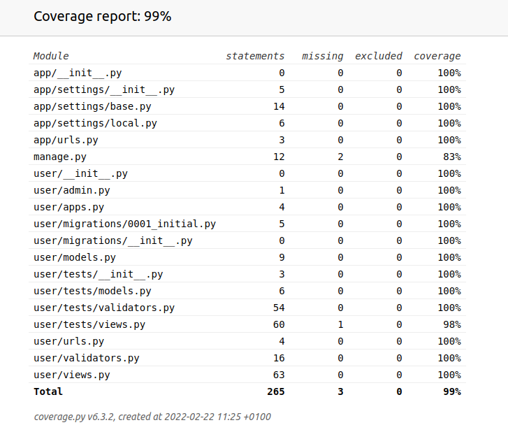

# Project description

This project is to build a backend based on `Django` framework with an application named `user`. The application is able to create, update, remove a single user and view all users from the database. 

# Application `user`

`user` is an application with a model called `User`, consisting of three fields: `usename`, `password` and `email`. Each of fields is defined with following properties. Each characteristic for every field is validated.

<ul>
    <li> username: consists of a string with the length between 2 and 32 <li> password: consists of a string with the length between 8 and 32 and contains at least one uppercase, one lowercase and one number
    <li> email: contains <b>@</b> and <b>extension</b> and is supposed to be unique in the database.
</ul>

# How to run project
prerequisite: 
* `docker-compose`
* [Build prerequisities](https://www.psycopg.org/docs/install.html#install-from-source) for psycopg2

run `sudo docker-compose up`

# Utilization of API

There are four endpoints implemented in the project. Three of them are bundled with the specific http methods. Each API is illustrated with examples. 

* `/api/view-all`
    * Definition: view all users in the database
    * Http method: not specificed. Default: GET
    * Response Content example:
        ```
        {
            "success": 1,
            "users": [
  
            ]
        }
        ```
* `/api/create`
    * Definition: create a new user in the database
    * Http method: POST
    * Request body example:
        ```
        {
            "username": "user",
            "password": "Passw0rd",
            "email": "example@gmail.com",
        }
        ```
    * Response Content example:
        ```
        {
            "success": 1,
            "msg": "user has been successfully created"
        }
        ```
* `/api/update`
    * Defintion: update some fields given an existing user in the database
    * Http method: PUT
    * Request body example:
        ```
        {
            "pk": 1,
            "username": "user",
            "password": "Passw0rd",
            "email": "new@gmail.com"
        }
        ```
    * Response Content example:
        ```
        {
            "success": 1,
            "msg": "Updated successfully"
        }
        ```

* `/api/remove`
    * Defintion: update an user from the database
    * Http method: DELETE
    * Request body example:
        ```
        {
            "pk": 1
        }
        ```
    * Response Content example:
        ```
        {
            "success": 1,
            "msg": "Deleted successfully"
        }
# Local Version vs Beta Version

The difference between local and beta version is database. SQLite is used as database to run local version. This version is used to develop and extend the features of the project for the developers. It is also good to know that it is necessary to configure `SECRET_KEY`, install dependency libraries and make migrations in your local environment before running the project.

For the Beta Version, I used posgreSQL served as database. Data migration and tests are automatically proccessed before lauching the web server. 


# Testing Section

Testing is seen an important part in this project. In order to cover and detect what are necessary to be tested, I employed [`coverage`](https://coverage.readthedocs.io/en/6.3.2/) to evaluate my test sets.



Since Django has built-in module based on `unittest` for testing, I did not choose third-party library to build the test cases. To detect and run test cases in the project, run

```python manage.py test -v 2```

where `-v 2` is an optional tag to verbose each test case with name, testing result, and other info, for instance, print statements. 


